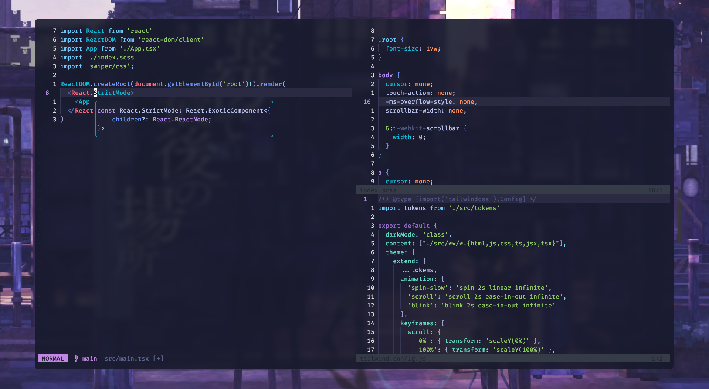

# Sentinel
My Neovim setup written in Lua with LSP support and a simple UI, keeping things light and simple.    

## Requirements
- Neovim > 0.9
- Git
- ripgrep *(For Telescope)*
- C compiler *(for nvim-treesitter)*
- Terminal with true color support *(I use Kitty)*
- Nerd fonts
- Tmux *(Optional)*
